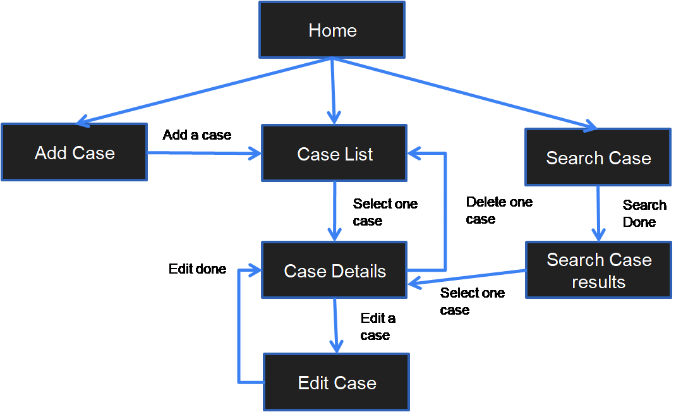

# GhostHub

## Summary

This project is where users can share their paranormal encounters with others, by uploading their encounter information and image of the paranormal on our website.

<ins>Organisation goals:</ins>
<ul>
	<li>Promote awareness of haunted locations so that users can safely avoid the area</li>
	<li>Provide thrill seekers a venue to explore the unknown</li>
	 <li> Some Singaporeans do paranormal investigation in creepy locations as a hobby. With this platform, it can encourage them to turn their activity into a business opportunity by increasing their visibility and rating. In a way, this platform serves as an advertising platform</li>
</ul>
	 
<ins>User goals:</ins>
	<ul>
		<li> Users in general want to know where are places that are haunted so that they can avoid the place, or at least be aware of the dangers.</li>
		<li> Users also want to share their paranormal experiences in hopes of finding people who have experienced the same thing.</li>
		<li> Some paranormal investigators wants to know places that are usually haunted so that they can accurately capture paranormal sightings</li>
		<li> Paranormal investigators also wants to know users paranormal experiences in certain location. With that, the investigators can conduct their investigation in the location of interest. </li>
	</ul>

<ins>Motivation</ins>

After looking at "It must be the hantu" Facebook page, there are actually many Singaporeans who have their paranormal stories to tell.

About some years ago, a new hobby emerged. It is called urban exploration (UrbEx), where people explore abandoned locations so that they get a view of how it was like back in the days. It may not necessarily be a paranormal investigation but there some reports of UrbEx explorers who made contact with the unseen. 

There are some paranormal investigators who would go to the extreme by going into haunted places alone, so they need to capture all images as evidence.

 This project aims to be a main base for people to share their paranormal encounters 
 and for paranormal research and references. The whole idea is inspired from the SCP (Secure, Contain, Protect) Foundation, a fictional foundation where people share details of anomalous creatures online and classify each of them according to its characteristics. For example: SCP-457 (Burning Man) (https://vocal.media/horror/10-dangerous-sc-ps-that-must-never-escape-part-2)

<ins>GhostHub Link:</ins>
	<ul>
		<li>https://affectionate-wescoff-87accd.netlify.app</li>
	</ul>

## UI/UX 
### Stratergy
<ins>User Stories</ins>

As a **paranormal witness** I want to **create my paranormal case report** So that **share it with others**

As a **paranormal witness** I want to **delete my paranormal case report** So that **in case the case report is no longer relevant**

As a **paranormal witness** I want to **edit my paranormal case report** So that **I can make some changes to the case report**

As a **paranormal witness** I want to **see my paranormal case report** So that **I can share my case report with others and others can see my report**

As a **paranormal witness** I want to **create one or more paranormal encounter in each case report** So that **I can attach different paranormal encounters for the same case report**

As a **paranormal witness** I want to **delete one or more paranormal encounter in each case report** So that **remove encounters that are no longer relevant**

As a **paranormal witness** I want to **edit one or more paranormal encounter in each case report** So that **I can make changes to each encounters**

As a **paranormal witness** I want to **see one or more paranormal encounter in each case report** So that **I can share my encounters in the case report with others and others can see my encounters**

As a **paranormal witness** I want to **share images of my encounter** So that **I can provide evidence of my encounter**

As a **commentor** I want to **add a comment** So that **share my opinion about certain cases**

As a **commentor** I want to **delete a comment** So that **remove statements that I regret typing**

As a **commentor** I want to **edit a comment** So that **change my opinions regarding certain cases**

As a **commentor** I want to **see a comment** So that **share my opinions and see the opinions of others regarding certain cases**

As a **viewer** I want to **paranormal case classified based on certain characteristics** So that **can understand the paranormal experiences of others**

<ins>Acceptance criteria</ins>
<ul>
	<li>Witnesses can see edit delete and create cases</li>
	<li>Witnesses can see edit delete and create encounters within each cases</li>
	<li>Commenters can see edit delete and create their comments about certain cases</li>
		<li>Viewers can see images, case title, equipment used, etc as some important attributes of cases and encounters are made compulsory for input</li>
</ul>

### Scope
<ins>Functional requirements</ins>

<ul>
	<li>Case Reports</li>
	<ul>
		<li>User can create a case</li>
		<li>User can delete a case</li>
		<li>User can edit a case</li>
		<li>User can read a case</li>
		<li>User can like a case through their comments</li>
	</ul>
	<li>Encounters</li>
	<ul>
		<li>User can create an encounter while creating a case</li>
		<li>User can delete an encounter while creating a case</li>
		<li>User can edit an encounter while creating a case</li>
		<li>User can read an encounter while creating a case</li>
		<li>User can create an encounter while editing a case</li>
		<li>User can delete an encounter while editing a case</li>
		<li>User can edit an encounter while editing a case</li>
		<li>User can read an encounter while editing a case</li>
	</ul>
	<li>Comments</li>
	<ul>
		<li>User can post a comment</li>
		<li>User can edit a comment</li>
		<li>User can delete a comment</li>
		<li>User can read a comment</li>
	</ul>
</ul>

<ins>Non-functional requirements</ins>
<ul>
	<li>Mobile responsiveness: As the website will have many texts, a proper size and font is needed for mobile users to have ease of reading.</li>
	<li>Localization criteria: As of now it can only be used in local context as different cultures have their own sets of paranormal entities. This is a requirement for the entity tags used in the website which classifies the paranormal encounters.</li>
	<li>Accessibility criteria: Only for those who are not visually impaired</li>
	<li>Security: The client and backend inputs are validated. Passwords are not stored in the server.</li>
	<li>Privacy: Only emails will be stored for case identification purposes</li>
	<li>Not Applicable: Performance</li>
</ul>

### Structure
Structure used:

Linear Network Hybrid

Information organisation:

Information is organised in a way that the user can read the content as much as possible. That is why, in the laptop size, the navbar is put to the side so that the user have as much vertical space as possible to scroll up and down. As illustrated in the Skeleton section

### Skeleton
<ins>Desktop Mockup</ins>

<ins>Mobile Mockup</ins>

### Surface

<ul>
	<li>Appearance</li>
		<ul>
			<li>Typography: </li>
				<ul>
				<li>Bebas Neue. For main titles because it is very eye-catching.</li>
				<li>Abel: For contents. It looks easy on the eyes and modern. Good for long texts that users might post</li>
				</ul>
			<li>Color:</li>
				<ul>
				<li>Blue: Primary color. A lot of bank websites use blue. It gives the impression of trust. The idea is to show that our website means serious business and hopefully can convey the message to the public to contribute seriously to the database. </li>
				<li>rgb(0, 247, 255): Secondary color. Using a color neighbor of blue to prevent too much contrast. This color is used for highlighting buttons and tags.  </li>
				<li>Black: To add a tinge of mystery to the overall look.</li>
				</ul>
			<li>Font Size:</li>
				<ul>
				<li>Big texts are to catch the users attention. Mostly used in titles. Smaller texts are used for the 			contents</li>
				</ul>
			<li>Layout:</li>
				<ul>
				<li>Since it will be text heavy due to user input, the space will be expanded vertically downward. All the layout decisions considered will be based on what are the possible inputs from the user. For example, nothing should be put besides the image as images comes in various dimensions. So, to be safe, all texts will be placed at the bottom of the image. Some texts might be very long so care has been taken to ensure that there is nothing on left or the right of the text as everything is created to expand downwards. The nav bar is put on the  side in laptop screen so that it gives the user full view of the contents.</li>
				</ul>
		</ul>
	<li>Mobile Requirement:</li>
		<ul>
				<li>This is achieved by starting from the mobile layout. The most important thing to keep track is the size of components, like words, icons etc. Because this will change when the website runs on a bigger screen, therefore the size of the components and the screens must be proportionate.</li>
	 </ul>
</ul>

## Features
### Feature List
<ul>
	<li>Create, read, update and delete cases</li>
	<li>Create, read, update and delete encounters</li>
	<li>Create, read, update and delete comments</li>
	<li>Search function based on tags and date range</li>
	<li>Display cases, encounters and comments</li>
</ul>

### Feature Flow

<ul>
	<li>Case List: When the user access the website, the user will see a list of cases. User can select on one of the cases</li>
	<li>Case Details: The use will then be presented with a case details where all the data about a user's paranormal enconters will be displayed. From there, he can either delete the case or edit the case.</li>
	<li>Edit Case: User can edit the case and also add delete or edit encounters. After that they will come back to the Case Details page </li>
	<li>Add Cases: Allows user to input a set of data and also add delete or edit encounters. After they click submit, the website will bring the user to the Case List page, where the user can see his added case</li>
	<li>Search Cases: Allows users to input search criterias, which is the tags, date to and date from. After clicking on the search button, a set of result will be returned to the user. From there, users can access each case in the Case Details page</li>
</ul>

### Future Implementations
<ul>
	<li>A rating system. It was implemented halfway, users can save their likes for cases but for now the display of ratings is not implemented</li>
	<li>Using a map to choose location. Users can use the map to show the place of encounters. The map should also be displayed in the Cases Details page.</li>
	<li>Authentication and authorisation. For now, email is used to tie cases to the users who created it.</li>
</ul>

### Bugs
<ul>
	<li>About Us page: For now it cannot work as the page isn't ready for now</li>
</ul>

## Technology used

<ul>
	<li>Axios</li>
	    <ul>
		    <li>It is a technology used to give the program HTTP client capability</li>
			<li>Purpose: It used to make HTTP requests to APIs/URLs to retrieve data from the server</li>
			<li> https://github.com/axios/axios</li>
		</ul>
	<li>Bootstrap CSS</li>
	    <ul>
		    <li>A library which has pre-made css components</li>
			<li>Purpose: for fast building of CSS on websites</li>
			<li>https://getbootstrap.com/</li>
		</ul>
	<li>Google Fonts</li>
	    <ul>
			<li> Additional fonts for HTML</li>
			 <li>https://fonts.google.com/</li>
		</ul>
	<li>React</li>
		<ul>
			<li> Front end framework based on JS</li>
			<li>Purpose: A framework which uses state to manipulate frontend webpages</li>
			<li>https://reactjs.org/</li>
		</ul>
	<li>Mongodb </li>
		<ul>
			<li> A document based database using NoSQL</li>
			<li>Purpose: The database behind the backend server to store data from users</li>
			<li>https://www.mongodb.com/</li>
		</ul>
	<li>Nodejs </li>
		<ul>
			<li> It is a JS backend runtime environment</li>
			<li>Purpose: The basic building block for the backend server</li>
			<li>https://nodejs.org/en/</li>
		</ul>
	<li>Express</li>
		<ul>
			<li> A backend framework for node.js</li>
			<li>Purpose: to send and receive HTTP communications via the built-in GET, POST , PUT, etc</li>
			<li>https://expressjs.com/</li>
		</ul>
</ul>

## Tests

| Test Case # | Test Case Description |Test Steps|Expected Result|
|--|--|--|--|
|1|User accesses the main URL|1. Go to URL (under Summary section)|A list of cases will appear in the Cases List page|
|2|User looks into Case Details|1. From the Cases List page, click on "Continue" button on one of the cases|Case details will appear showing at least on encounter and comments if available.|
|3|User wants to edit a Case|1.  From the Cases List page, click on "Continue" button on one of the cases 2. Click on "Edit" button. Edit page will appear and change the case title to "A haunting" 3. Click on the "Submit!" button.|The website will bring user back to the Case Details page with a change to the Case title|
|4|User wants to delete a Case|1.  From the Cases List page, click on "Continue" button on one of the cases 2. Click on "Delete" button 3. A prompt will appear above. Click on "Confirm!" |The  Website will bring the user to the  Cases List page|
|5|User wants to add a Case|1. Click on "Add Case" button on the side nav bar. Fill up the form -> Display Name: Bob, Occupation:Engineer, Age:30, Paranormal Encounter: <can be empty>, email address: test@gmail.com, title:A haunting, description:Scary house, Location: Creepy house, date:23/3/2021, Activity: Accidental, Entity Tags: Pocong, Pontianak. Fill up form for Encounter as well -> Image:https://images.unsplash.com/photo-1593642632559...., Description: This is a picture, Equipment Used: Phone Camera, Contact Type: Visual, Number of entities encountered:1, Time of Encounter: Morning 2. Click on "Add!" 3. Click on "Submit!"|The website will bring user back to the Cases List page with a new Case at the bottom of the list|
|6|User wants to post comment|1. From the Cases List page, click on "Continue" button on one of the cases. Scroll down to the "Comments" section, enter in the textbox: This is very scary! 2. Click on "Add!"|A popup box in green will appear saying that "Comment Added"|
|7|User wants to edit comment|1. From the Cases List page, click on "Continue" button on one of the cases. Scroll down to the "Comments" section. 2. Click on "Edit" on the comment added earlier, enter in the textbox: This is not so scary! 3. Click on "Done!"|A popup box in green will appear saying that "Comment Edited" and the earlier added comment has been changed|
|8|User wants to delete comment|1. From the Cases List page, click on "Continue" button on one of the cases. Scroll down to the "Comments" section. 2. Click on "Delete" on an available comment|A popup box in green will appear saying that "Comment Deleted"|
|9|User wants to search cases|1.Click on "Search Cases" button on the side nav bar. For the Entity tag, select Pontianak, then select the dates 2. Click on "Search". A list of cases will be returned to user. 3. Click on the "Continue" button on one of the searched cases|The website will return a list of cases and user can choose which cases he want to look into by clicking on the "Continue" buttons on one of the cases.|
||Prerequisite: Needs to be in Edit Case page or Add Case page|||
|10|User wants to add an Encounter|1. Scroll down to Add an Encounter section. Fill the form -> Image:https://images.unsplash.com/photo-1593642632559...., Description: This is a picture, Equipment Used: Phone Camera, Contact Type: Visual, Number of entities encountered:1, Time of Encounter: Morning 2. Click on "Add!" 3. Click on "Submit!"|The website will bring user back to the Case Details page with a new Encounter|
|11|User wants to edit an Encounter|1. Scroll down to Encounter Details section and click on "Edit" on one of the encounters. 2.Change the Description to "This is a scary place". Click on "Done!" 3. Click on "Submit!"|The website will bring the user back to the Case Details page with a change in the Descripton of and Encounter|
|12|User wants to delete an Encounter|1. Scroll down to Encounter Details section and click on "delete" on one of the encounters. 2.Click on "Submit!"|The website will bring the user back to the Case Details page with the deleted Encounter removed|

## Deployment
<ul>
	<li>Backend: Uploaded to Heroku</li>
	<li>Frontend: Uploaded to Netlify</li>
</ul>

## Credits

| Acknowledgements | Link |
|--|--|
| Axios | https://github.com/axios/axios|
|Bootstrap CSS|https://getbootstrap.com/|
|Google Fonts|https://fonts.google.com/|
|Express|https://expressjs.com/|
|NodeJS|https://nodejs.org/en/|
|Mongodb|https://www.mongodb.com/|
|React|https://reactjs.org/|
